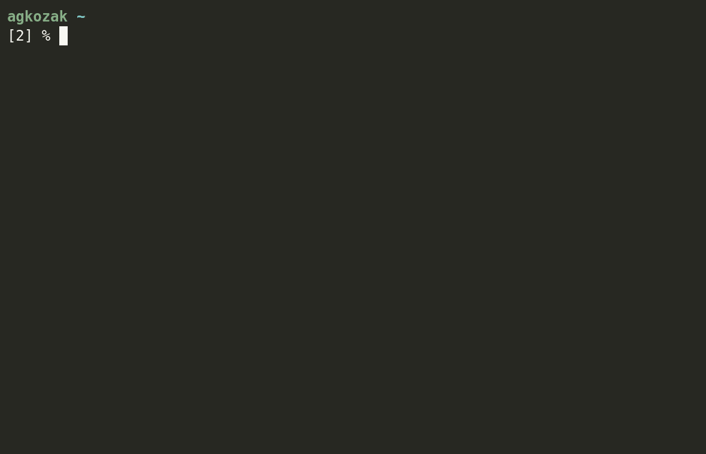

# zhooks

**zhooks** is a function/command that displays the contents of all ZSH hook arrays (such as `$precmd_functions`) as well as any hook functions (such as `precmd`) that have been defined. It also returns true when any hooks have been defined and false when they have not. It is intended to be used in debugging conflicts between scripts.

Simply source zhooks from your `.zshrc`:

    source /path/to/zhooks.zsh

or load it using your favorite ZSH framework.

Then run the command `zhooks` from the command line to see a thorough report. You can even use the `zhooks` function in a script (provided, of course, that it sources `zhooks.zsh`), for example:

    if zhooks &> /dev/null; then
      echo 'Hooks are being used.'
    else
      echo 'This house is clean.'
    fi
